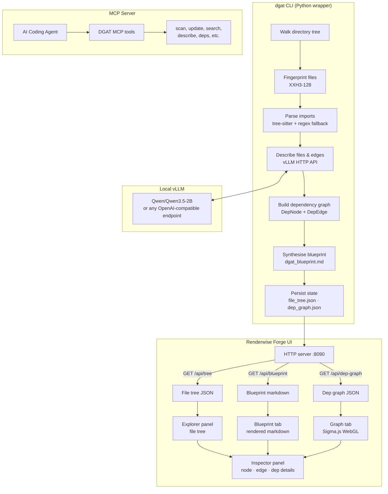

<div align="center">

# DGAT
### Dependency Graph as a Tool

*Point it at a codebase. Get a fully-described, LLM-annotated dependency graph — instantly.*


</div>

---

## What is this?

DGAT scans any codebase, uses a locally-hosted LLM to write natural-language descriptions for every file and every import relationship, then serves it all through an interactive three-panel UI. Think of it as a self-generating architectural map — no config files, no annotations, no manual work.

**Available as a Python package** — install with `pip install dgat` and you're ready to go.

---

## Quick start

### 1. Install DGAT

```bash
pip install dgat
# requires Python 3.11+
```

### 2. Configure your LLM provider

```bash
# Interactive setup
dgat config init

# Or configure manually (vLLM example)
dgat config set providers.vllm.endpoint http://localhost:8000
dgat config set providers.vllm.model Qwen/Qwen3.5-2B
```

**Supported providers:** vLLM, Ollama, OpenAI, Anthropic, OpenRouter (any OpenAI-compatible endpoint)

### 3. Start your LLM server

```bash
# vLLM example
vllm serve Qwen/Qwen3.5-2B --port 8000
```

### 4. Run on your project

```bash
dgat scan /path/to/your/project
# outputs: file_tree.json, dep_graph.json, dgat_blueprint.md
```

---

## CLI commands

| Command | Description |
|---|---|
| `dgat scan [path]` | Full codebase scan — builds tree, descriptions, dep graph, blueprint |
| `dgat update [path]` | Incremental re-scan (changed files only) |
| `dgat search <query>` | Search files by name or description |
| `dgat describe <rel_path>` | Get LLM-generated description for a specific file |
| `dgat deps <rel_path>` | Show files that the given file depends on |
| `dgat dependents <rel_path>` | Show files that depend on the given file |
| `dgat blueprint` | Get the architectural blueprint (dgat_blueprint.md) |
| `dgat mcp` | Start MCP server (stdio mode) |
| `dgat mcp --http` | Start MCP server (HTTP mode) |
| `dgat backend` | Start API backend server |
| `dgat config show` | Show current configuration |
| `dgat config set <key> <value>` | Set a configuration value |
| `dgat config test` | Test if the provider API is working |

---

## Python API

Import DGAT directly in your Python code:

```python
from dgat import run_scan, run_update
from dgat import FileTree, DepGraph

# or from dgat.scanner import search_files
```

---

## MCP server

Use DGAT as a tool in AI coding agents via the Model Context Protocol:

```bash
dgat mcp              # stdio mode (for local agents)
dgat mcp --http       # HTTP mode (for remote agents)
```

**Available tools:** `scan`, `update`, `describe_file`, `get_dependencies`, `get_dependents`, `get_blueprint`, `search_files`, `get_file_tree`, `get_dep_graph`

---

## Architecture



---

## Features

- **Multi-language import extraction** — TypeScript, JavaScript, Python, C/C++, Go, Java, Rust, C#, Ruby, PHP, CUDA, Bash, and more. Tree-sitter grammars for precision, regex fallback for everything else.
- **LLM-annotated graph** — every file node and every dependency edge gets a concise description generated by a local model. No cloud, no API keys.
- **Project blueprint** — a synthesised `dgat_blueprint.md` built bottom-up from all file descriptions.
- **Incremental updates** — `dgat update` re-describes only files whose XXH3 fingerprint changed.
- **MCP integration** — use DGAT as a tool in AI coding agents via the Model Context Protocol.
- **Static export** — embed the entire graph into a single self-contained HTML file. Share with anyone, no server required.
- **Live UI** — auto-refreshes every 30 s. Three-panel layout with file explorer, blueprint/graph tabs, and an inspector.

---

## Demo

### 1. Start the vLLM server

Before running DGAT, bring up a local vLLM instance. DGAT uses it to generate descriptions for every file and dependency edge.


---

### 2. Run the scan

Point DGAT at your project. It walks the file tree, fingerprints every file, sends them to vLLM, and builds the dependency graph.


Dependency extraction runs in parallel — here's the tail end where import relationships are resolved and edges are formed:


---

### 3. Open the UI

Start the backend server and the frontend. Three panels: file explorer on the left, blueprint/graph in the middle, inspector on the right.

**Blueprint tab** — a synthesised architectural overview of the whole project, generated bottom-up from individual file descriptions:


**File inspector** — click any file in the explorer to see its description, dependencies, and metadata:


Select a file like `dep_graph.json` to see its role in the project explained inline:


---

### 4. Explore the dependency graph

Switch to the **Graph tab** for an interactive WebGL view of all import relationships. Node size reflects connectivity.

**Single node selected** — click any node to see a full LLM-generated analysis of that file, plus its outgoing/incoming edges at the bottom:


**Two nodes selected** — click a second node to inspect the direct edge between them: the import statement, and a plain-English explanation of why one depends on the other:


---

## Tech stack

| Layer | Tech |
|---|---|
| Package | Python 3.11+ · pip-installable |
| CLI | Click · Rich (terminal output) |
| Parsing | tree-sitter (C, C++, Python, TS, Go, Java, Rust, …) |
| LLM | vLLM · Qwen3.5-2B (any OpenAI-compat endpoint) |
| MCP | JSON-RPC 2.0 (stdio + HTTP) |
| Frontend | React · TypeScript · Tailwind CSS · Sigma.js · shadcn/ui |

---

## Example output

The [`examples/dgat-self/`](examples/dgat-self/) folder contains the output DGAT produced when pointed at its own source tree — a blueprint, file tree, and dependency graph all generated by **Qwen3.5-2B** running locally via vLLM. Browse it to get a feel for the output format without running a scan yourself.

---

## .dgatignore

DGAT respects a `.dgatignore` file in the root of the scanned project. It works like `.gitignore` — one glob pattern per line — and tells DGAT which files and directories to skip during description and graph-building passes (files that match are still shown in the tree but their LLM descriptions and dependency edges are suppressed).

```
# .dgatignore example
node_modules/
*.lock
vendor/
```

Files already covered by `.gitignore` are automatically excluded from LLM processing regardless.

---

## Docs

- [Overview](docs/overview.md) — how DGAT works end to end
- [File Tree](docs/file-tree.md) — TreeNode structure, fields, and why each one exists
- [Dependency Graph](docs/dependency-graph.md) — DepNode, DepEdge, DepGraph, and how the graph is built
- [Incremental Updates](docs/incremental-updates.md) — how the diff mode works with XXH3 fingerprints
- [Import Extraction](docs/import-extraction.md) — tree-sitter parsing, regex fallbacks, and path resolution

---

> gonna scavenge some popular repos, and see how my thing behaves with it, and use my populated context for something useful.
