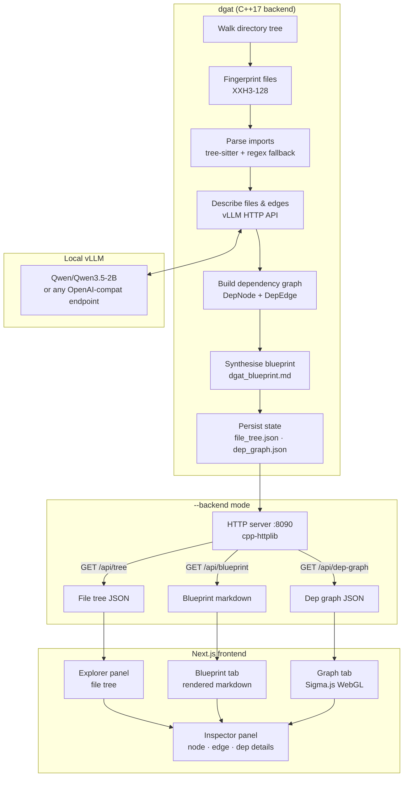
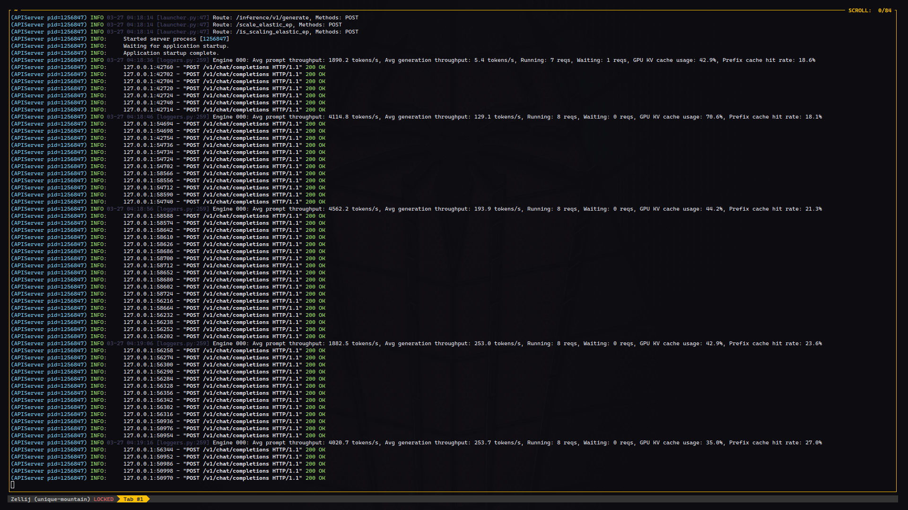
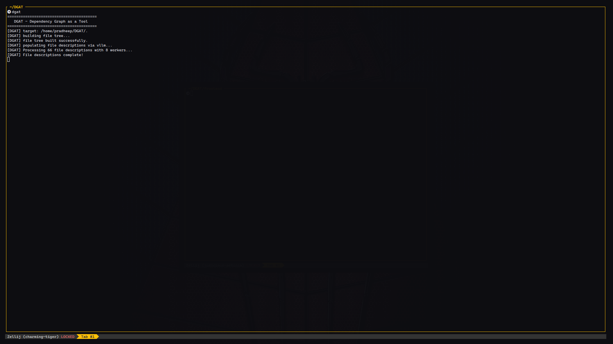
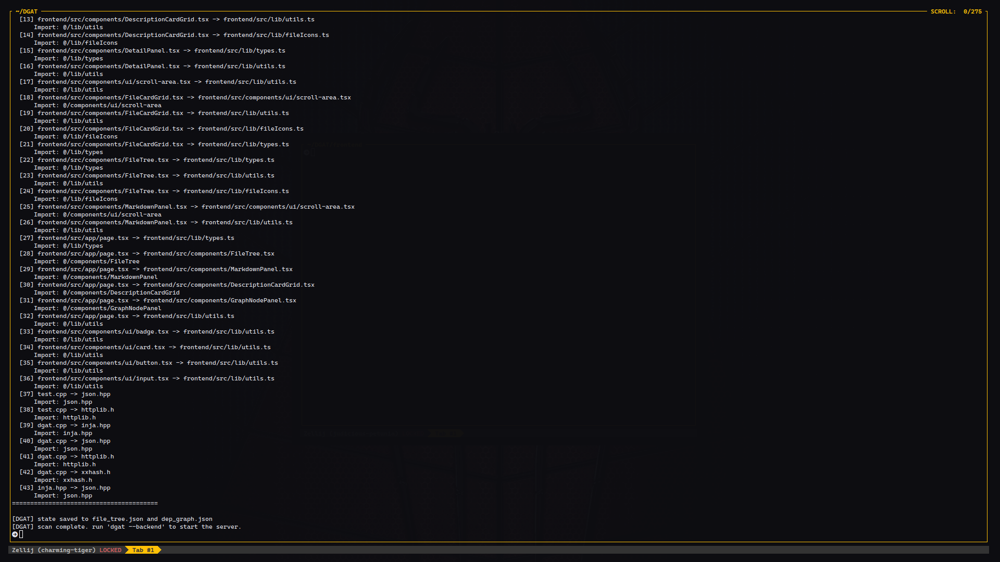
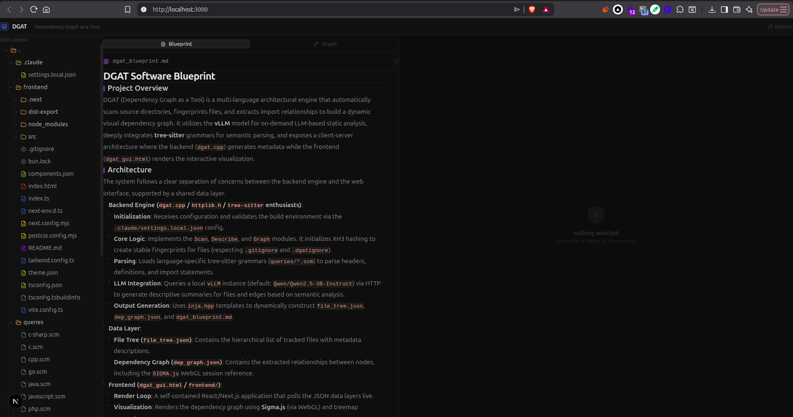
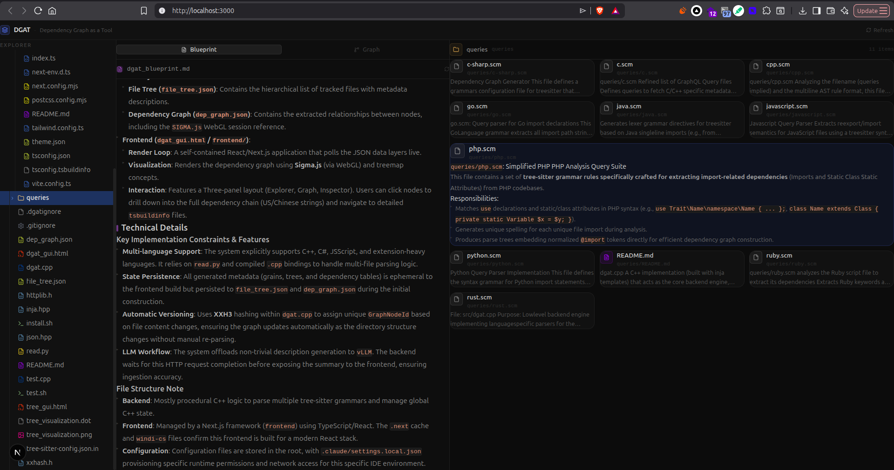
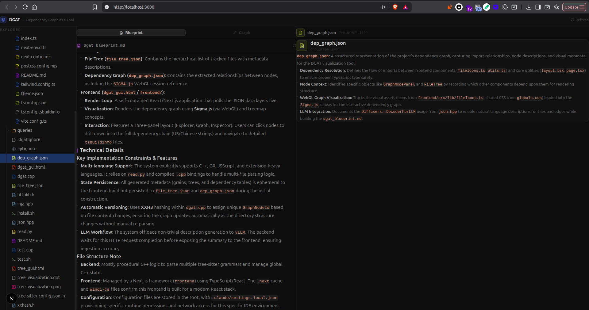
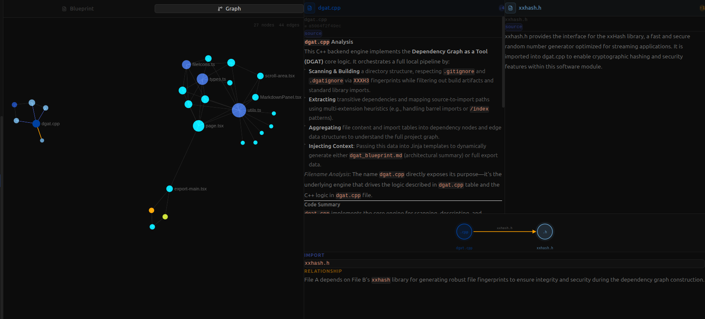
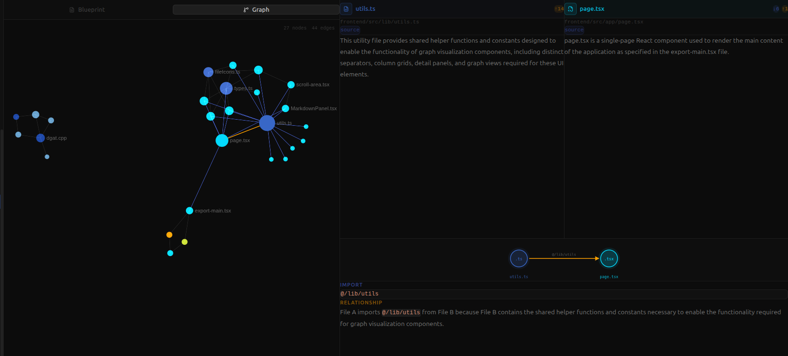
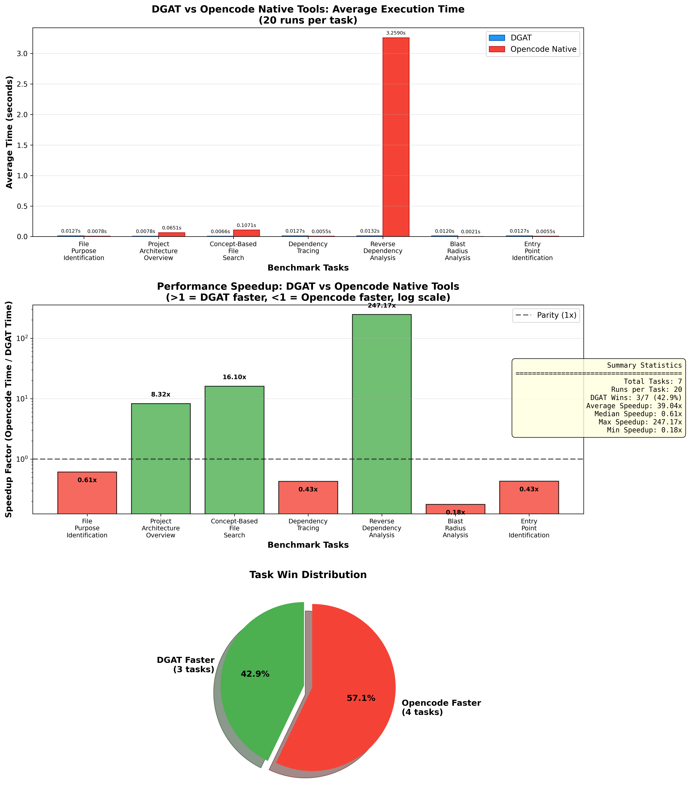

<div align="center">

# DGAT
### Dependency Graph as a Tool

*Point it at a codebase. Get a fully-described, LLM-annotated dependency graph — instantly.*


</div>

---

## What is this?

DGAT scans any codebase, uses a locally-hosted LLM to write natural-language descriptions for every file and every import relationship, then serves it all through an interactive three-panel UI. Think of it as a self-generating architectural map — no config files, no annotations, no manual work.

---

## Architecture



---

## Demo

### 1. Start the vLLM server

Before running DGAT, bring up a local vLLM instance. DGAT uses it to generate descriptions for every file and dependency edge.



---

### 2. Run the scan

Point DGAT at your project. It walks the file tree, fingerprints every file, sends them to vLLM, and builds the dependency graph.



Dependency extraction runs in parallel — here's the tail end where import relationships are resolved and edges are formed:



---

### 3. Open the UI

Start the backend server and the frontend. Three panels: file explorer on the left, blueprint/graph in the middle, inspector on the right.

**Blueprint tab** — a synthesised architectural overview of the whole project, generated bottom-up from individual file descriptions:



**File inspector** — click any file in the explorer to see its description, dependencies, and metadata:



Select a file like `dep_graph.json` to see its role in the project explained inline:



---

### 4. Explore the dependency graph

Switch to the **Graph tab** for an interactive WebGL view of all import relationships. Node size reflects connectivity.

**Single node selected** — click any node to see a full LLM-generated analysis of that file, plus its outgoing/incoming edges at the bottom:



**Two nodes selected** — click a second node to inspect the direct edge between them: the import statement, and a plain-English explanation of why one depends on the other:



---

## Features

- **Multi-language import extraction** — TypeScript, JavaScript, Python, C/C++, Go, Java, Rust, C#, Ruby, PHP, Bash, and more. Tree-sitter grammars for precision, regex fallback for everything else.
- **LLM-annotated graph** — every file node and every dependency edge gets a concise description generated by a local model. No cloud, no API keys.
- **Project blueprint** — a synthesised `dgat_blueprint.md` built bottom-up from all file descriptions.
- **Incremental updates** — `dgat update` re-describes only files whose XXH3 fingerprint changed.
- **Static export** — embed the entire graph into a single self-contained HTML file. Share with anyone, no server required.
- **Live UI** — auto-refreshes every 30 s. Three-panel layout with file explorer, blueprint/graph tabs, and an inspector.

---

## Benchmarks

DGAT was benchmarked against Opencode's native general-purpose tools (grep, glob, read/write/edit, task agents) across 7 common codebase analysis tasks. Each task was run 20 times against the DGAT codebase itself.

### Performance Comparison



| Task | DGAT (avg) | Opencode (avg) | Speedup | Winner |
|------|------------|----------------|---------|--------|
| Reverse Dependency Analysis | 13.2 ms | 3.26 s | **247.2x** | DGAT |
| Concept-Based File Search | 6.6 ms | 107.1 ms | **16.1x** | DGAT |
| Project Architecture Overview | 7.8 ms | 65.1 ms | **8.3x** | DGAT |
| File Purpose Identification | 12.7 ms | 7.8 ms | 0.6x | Opencode |
| Entry Point Identification | 12.7 ms | 5.5 ms | 0.4x | Opencode |
| Dependency Tracing | 12.7 ms | 5.5 ms | 0.4x | Opencode |
| Blast Radius Analysis | 12.0 ms | 2.1 ms | 0.2x | Opencode |

### Key Findings

**DGAT dominates** for tasks requiring understanding of code relationships and structure:
- **Reverse dependency analysis** (finding what files depend on a specific file): **247x faster** — grep-based approaches must scan every file in the codebase
- **Concept-based search**: **16x faster** — semantic search vs keyword matching
- **Architecture overview**: **8x faster** — pre-computed blueprint vs manual directory traversal

**Opencode native tools** are faster for simple text-based operations where the overhead of loading/querying the dependency graph isn't justified:
- File purpose identification, entry point detection, dependency tracing, and blast radius analysis are all simple grep/text operations where native tools win

### When to Use What

| Use DGAT when... | Use native tools when... |
|---|---|
| You need to understand code architecture | You need to find a specific string |
| You want to know what depends on a file | You're looking at a single file |
| You're planning a refactor or deletion | You need quick, one-off lookups |
| You want semantic/conceptual search | You know the exact filename or keyword |

---

## Getting started

### Prerequisites

- C++17 compiler (GCC 11+ / Clang 14+)
- CMake 3.16+
- A running [vLLM](https://github.com/vllm-project/vllm) instance (or any OpenAI-compatible endpoint) on `localhost`
- Node.js 18+ / Bun (for the frontend)

### Build & install

```bash
git clone https://github.com/yourname/dgat
cd dgat
cmake -B build && cmake --build build -j$(nproc)

# or use the install script
bash install.sh
```

### Run

```bash
# full scan — builds tree, descriptions, dep graph, blueprint
./build/dgat /path/to/your/project

# start the API server (no re-scan)
./build/dgat --backend

# start the frontend
cd frontend && bun dev
# open http://localhost:3000
```

---

## CLI reference

| Command | Description |
|---|---|
| `dgat [path]` | Full scan of the target directory |
| `dgat --backend` | Load saved state, start API server |
| `dgat update` | Incremental re-scan (changed files only) |
| `--port <n>` | Override API server port (default: 8090) |

---

## Tech stack

| Layer | Tech |
|---|---|
| Backend | C++17 · cpp-httplib · nlohmann/json · inja · xxHash |
| Parsing | tree-sitter (C, C++, Python, TS, Go, Java, Rust, …) |
| LLM | vLLM · Qwen3.5-2B (any OpenAI-compat endpoint) |
| Frontend | Next.js 14 · TypeScript · Tailwind CSS · Sigma.js · shadcn/ui |

---

## Example output

The [`examples/dgat-self/`](examples/dgat-self/) folder contains the output DGAT produced when pointed at its own source tree — a blueprint, file tree, and dependency graph all generated by **Qwen3.5-2B** running locally via vLLM. Browse it to get a feel for the output format without running a scan yourself.

---

## .dgatignore

DGAT respects a `.dgatignore` file in the root of the scanned project. It works like `.gitignore` — one glob pattern per line — and tells DGAT which files and directories to skip during description and graph-building passes (files that match are still shown in the tree but their LLM descriptions and dependency edges are suppressed).

```
# .dgatignore example
node_modules/
*.lock
vendor/
```

Files already covered by `.gitignore` are automatically excluded from LLM processing regardless.

---

## Docs

- [Overview](docs/overview.md) — how DGAT works end to end
- [File Tree](docs/file-tree.md) — TreeNode structure, fields, and why each one exists
- [Dependency Graph](docs/dependency-graph.md) — DepNode, DepEdge, DepGraph, and how the graph is built
- [Incremental Updates](docs/incremental-updates.md) — how the diff mode works with XXH3 fingerprints
- [Import Extraction](docs/import-extraction.md) — tree-sitter parsing, regex fallbacks, and path resolution

---

> gonna scavenge some popular repos, and see how my thing behaves with it, and use my populated context for something useful.
